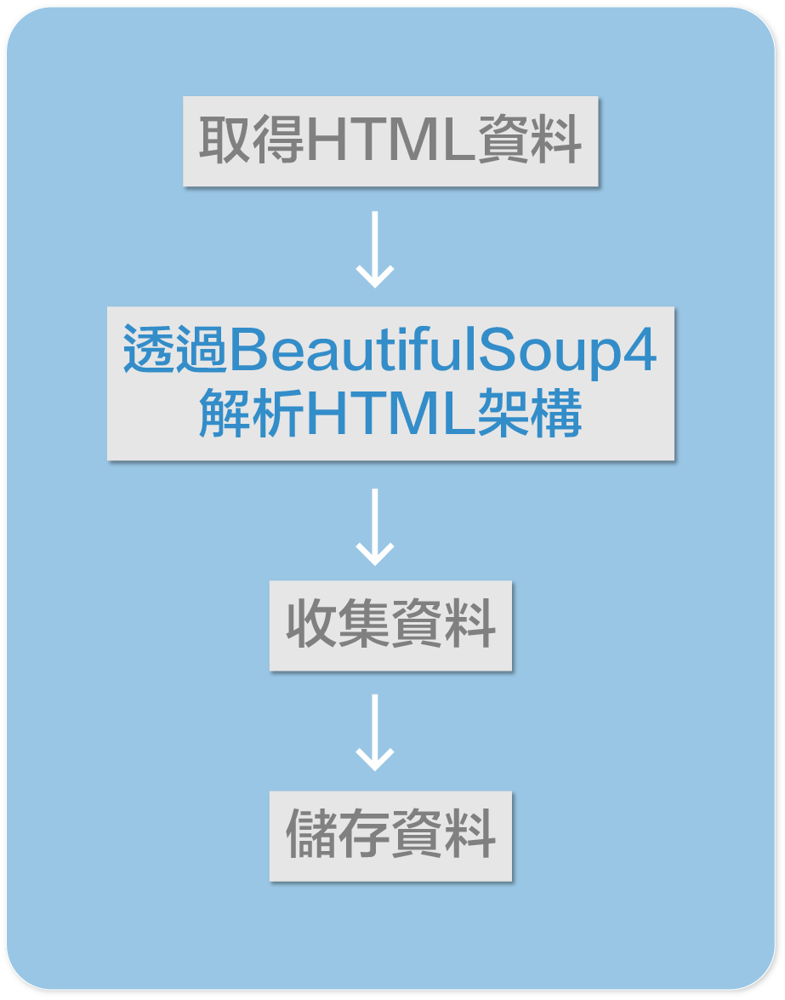
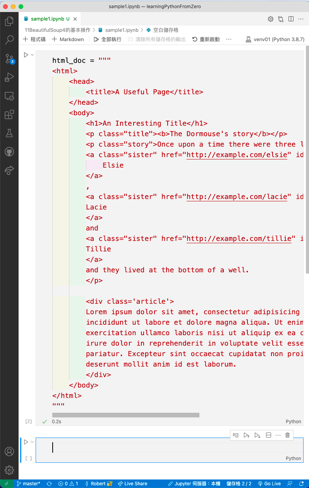
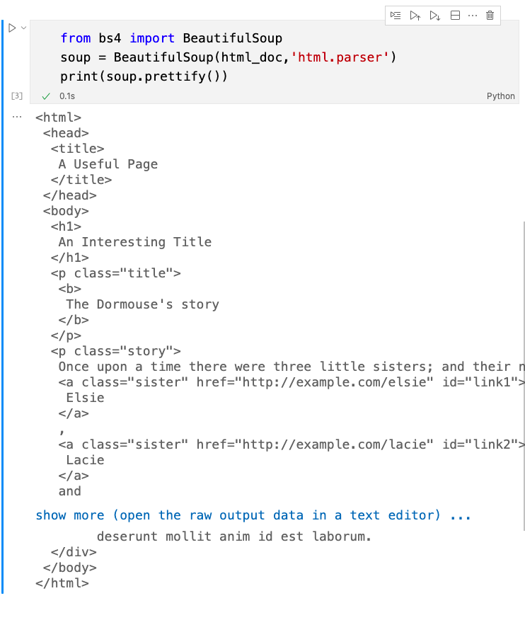

# BeautifulSoup4的基本操作

目前的學習進度地圖如下:



當可以從internet下載html資料後，接下來的動作必須解析html的所有架構，由於下載的html架構全是string型別，透過string型別的操作，取得有用的局部資料將會非常困難。

感謝BeautifulSoup4套件，BeautifulSoup4套件的主要功能就是可以全面解析HTML或XML的架構，透過簡單的操作，可取得想要的資料。

BeautifulSoup4是一個外部套件，專案內必需透過PyPI(Python Package Index)安裝BeautifulSoup4套件，安裝方法如下:

```python
pip install beautifulsoup4
```

## 範例1: 快速導覽BeautifulSoup4
> 以下範例是使用VSCode 延伸套件Jupyter Notebook，安裝方式請參考先前文章介紹

> 每個程式區塊代表的是一個儲存格

> 如下方圖示



```python
#手動建立html格式文字
html_doc = """
<html>
    <head>
        <title>A Useful Page</title>
    </head>
    <body>
        <h1>An Interesting Title</h1>
        <p class="title"><b>The Dormouse's story</b></p>
        <p class="story">Once upon a time there were three little sisters; and their names were
        <a class="sister" href="http://example.com/elsie" id="link1">
            Elsie
        </a>
        ,
        <a class="sister" href="http://example.com/lacie" id="link2">
        Lacie
        </a>
        and
        <a class="sister" href="http://example.com/tillie" id="link3">
        Tillie
        </a>
        and they lived at the bottom of a well.
        </p>

        <div class='article'>
        Lorem ipsum dolor sit amet, consectetur adipisicing elit, sed do eiusmod tempor 
        incididunt ut labore et dolore magna aliqua. Ut enim ad minim veniam, quis nostrud 
        exercitation ullamco laboris nisi ut aliquip ex ea commodo consequat. Duis aute 
        irure dolor in reprehenderit in voluptate velit esse cillum dolore eu fugiat nulla 
        pariatur. Excepteur sint occaecat cupidatat non proident, sunt in culpa qui officia 
        deserunt mollit anim id est laborum.
        </div>
    </body>
</html>
"""
```

- 以下為目前html的大約架構


## 載入BeautifulSoup套件
- 使用BeautifulSoup實體方法prettify(), 輸出修飾過的html

```python
from bs4 import BeautifulSoup
soup = BeautifulSoup(html_doc,'html.parser')
print(soup.prettify()) 
```

輸出結果:




## 開始導覽目前網頁的局部內容

#### 取出title元素內容(以下是title元素的架構)


```pyton
soup.title

輸出:===========
<title>A Useful Page</title>
```

#### 取出title元素標籤名稱

```python
soup.title.name

輸出:===========
'title'
```

#### 取出title元素內容

```python
soup.title.string

輸出:===========
'A Useful Page'
```

#### 取出title父元素標籤名稱

```python
soup.title.parent.name

輸出:===========
'head'
```

#### 取出h1元素(以下是h1元素的架構)


```python
soup.h1

輸出:===========
<h1>An Interesting Title</h1>
```

#### 取出第一個p元素(以下是p元素的架構)


- 當有多個相同元素時，取得第一個元素。

```
soup.p

輸出:===========
<p class="title"><b>The Dormouse's story</b></p>
```

#### 取出第一個p元素，class屬性的屬性值

```python
soup.p['class']

輸出:===========
['title']
```

#### 取出第一個a元素(以下是a元素的架構)


```python
soup.a

輸出:===========
<a class="sister" href="http://example.com/elsie" id="link1">
    Elsie
</a>
```

#### 取出所有的a元素

```python
soup.find_all('a')

輸出:===========
[<a class="sister" href="http://example.com/elsie" id="link1">
     Elsie
 </a>,
 <a class="sister" href="http://example.com/lacie" id="link2">
  Lacie
 </a>,
 <a class="sister" href="http://example.com/tillie" id="link3">
 Tillie
 </a>]
```

#### 取出id屬性為link3的元素

```python
soup.find(id='link3')

輸出:===========
<a class="sister" href="http://example.com/tillie" id="link3">
Tillie
</a>
```

#### 取出<a>標籤所有連結網址

```python
for link in soup.find_all('a'):
    print(link.get('href'))

輸出:===========
http://example.com/elsie
http://example.com/lacie
http://example.com/tillie
```


