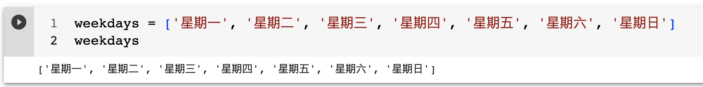
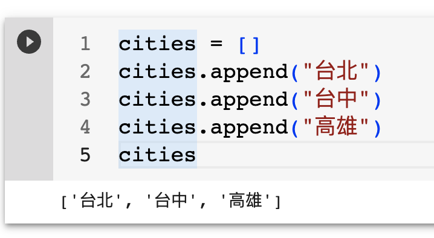
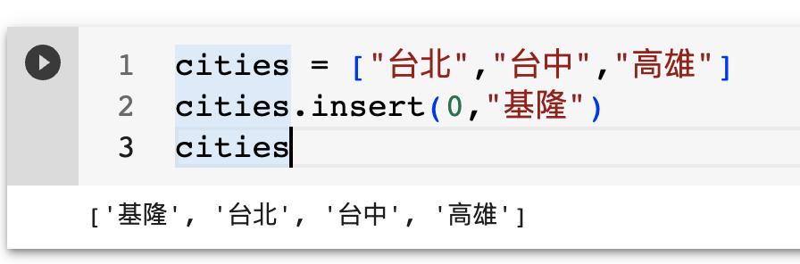
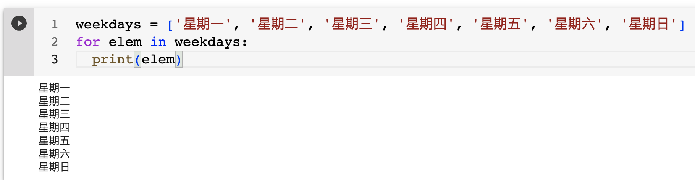
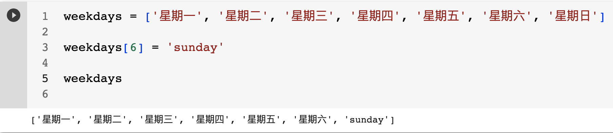
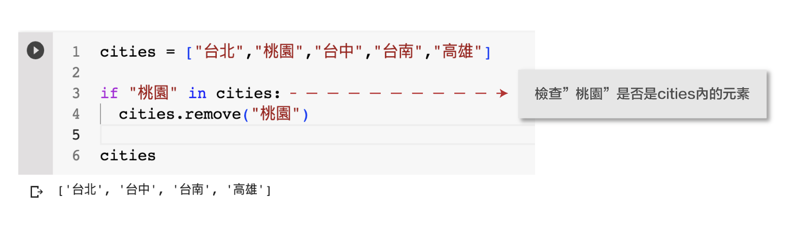
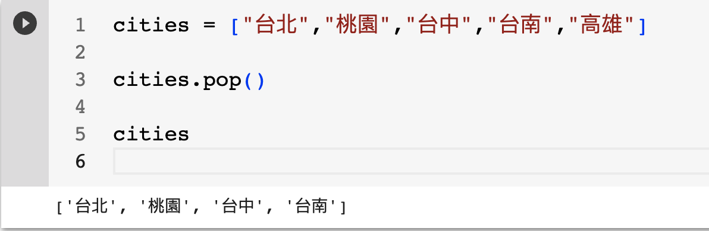

# python list操控
python的list, 就是一般常說的陣列,list操控是開發者最常使用的手法,靈活的操控list,也成為python必要的技能。

## list的主要功能

 - #### 儲存多組資料
 - #### 排序資料
 - #### 搜尋資料

## list常用的操控
 - #### 建立list
 - #### 新增元素
 - #### 選取元素
 - #### 讀取所有元素
 - #### 修改元素
 - #### 刪除元素
 - #### 切割元素

### 建立list
使用colab雲端編輯器,網址如下:

https://colab.research.google.com/?hl=zh-tw
#### 建立空list

```python
# 使用中括號 [] or list() 建立空的list

empty_list = [] #使用[]建立空的list
empty_list
```


#### 建立有內容的list

```python
weekdays = ['星期一', '星期二', '星期三', '星期四', '星期五', '星期六', '星期日'] 
weekdays
```


### 新增元素
- 使用append()
- 使用insert()

#### 使用append()新增元素
```python
cities = []
cities.append("台北")
cities.append("台中")
cities.append("高雄")
cities
```


#### 使用insert()新增元素

```python
cities = ["台北","台中","高雄"]
cities.insert(0,"基隆")
cities
```


### 選取元素
- 取存list元素,所依靠的是索引編號

```python
cities = ["台北","台中","高雄"]
print(cities[0])
print(cities[1])
print(cities[2])
```


### 讀取所有元素
- 利用for_in迴圈讀取所有內容

```python
weekdays = ['星期一', '星期二', '星期三', '星期四', '星期五', '星期六', '星期日'] 
for elem in weekdays:
  print(elem)
```



### 修改元素

```python
weekdays = ['星期一', '星期二', '星期三', '星期四', '星期五', '星期六', '星期日'] 

weekdays[6] = 'sunday'

Weekdays
```



### 刪除元素

- pop()->移除最後元素
- remove()->依元素值移除,沒有此元素,則出錯

#### remove()移除

```python
cities = ["台北","桃園","台中","台南","高雄"]

if "桃園" in cities:
  cities.remove("桃園")

cities
```



#### pop()移除最後一個元素

```
cities = ["台北","桃園","台中","台南","高雄"]

cities.pop()

cities

```



### 切割元素

```
hello_str = "HelloWorld"
hello_list = list(hello_str)
print(hello_list)

print(hello_list[0:5])

print(hello_list[:5])

print(hello_list[-5:])
```


#### 


