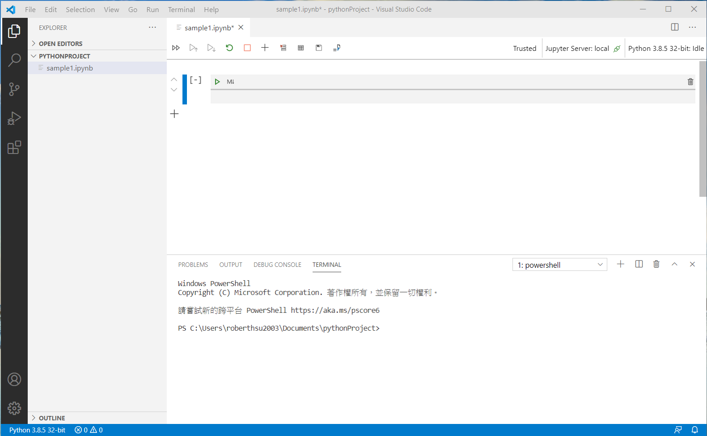
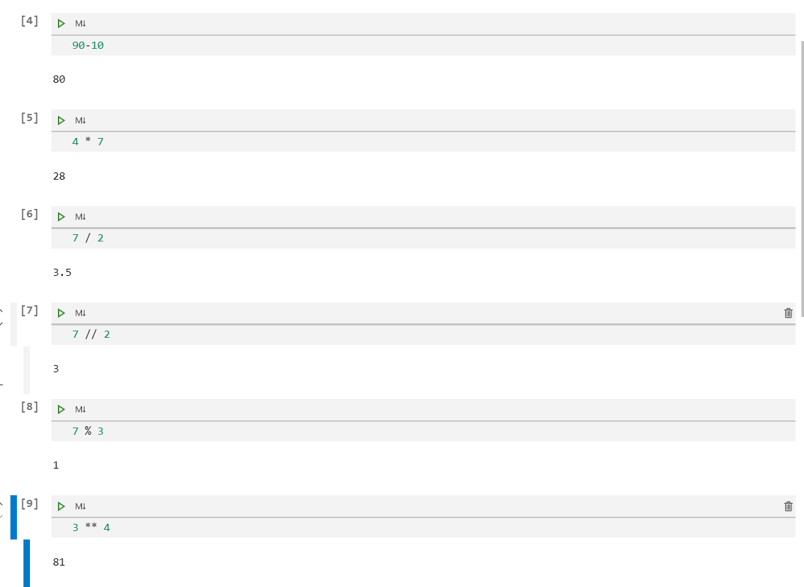
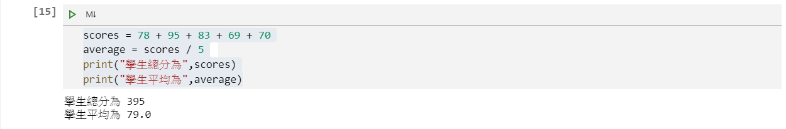

# python的基礎運算
當python的編輯環境已經建置完成,現在可以開始真正進入學習python,如果還沒有完成開發編輯環境,請參考「安裝python」這章節。

python可以成為目前最熱門的程式語言，主要原因是易學易懂，還有非常多免費的套件，整個開發生態環境非常完整，現在就來了解一些基本的數學運算。

## 1.建立一個學習檔案sample1.ipynb

請使用visual studio code 開啟一個jupyter建立的學習檔案，在這裏我就建立一個學習檔案sample1.ipynb,如下圖所見:



## 2.儲存格和輸出區域
在儲存格內輸入最簡單的加法運算 2 + 2 + 2 + 2 + 2,並按下執行按鈕,在輸出區域將出現運算結果10,如圖所示:


- 儲存格 - 就是編輯程式的位置，可以想像每一個儲存格可建立一個小的專案，按下執行按鈕，將會執行這個小專案。每個儲存格的最後一行，如果有傳出結果，則會顯示該內容至儲存格的輸出區域
- 輸出區域 - 會顯示該儲存格最後運算的結果，也可以顯示使用print()方法輸出的內容。
- 一個ipynb檔可以有多個儲存格和多個輸出區域

## 3.基本的數學運算

運算子 | 描述  | 範例
-----| ------- | ----
| + | 加法 | 5+8=13
| - | 減法 | 90-10=80  
| * | 乘法 | 4*7=28
| / | 浮點數除法 | 7 / 2=3.5
| // | 整數除法 | 7 // 2 = 3
| % | 餘數  | 7 % 3 = 1
| ** | 次方 |  3 ** 4 = 81

```python
#執行可以按快速鍵 shift + enter

>> 5+8
13

>> 90-10
80

>> 4 * 7
28

>> 7 / 2
3.5

>> 7 // 2 
3

>> 7 % 3
1

>> 3 ** 4
81
```

編輯方式如下圖所示:


## 4.先乘除後加減
問題1:一個學生5科的分數為78, 95, 83, 69, 70, 求總分和平均

```python
>> 78 + 95 + 83 + 69 + 70
395

>> 78 + 95 + 83 + 69 + 70 / 5  #先運算70/5,才進行加法運算
339.0
```


解法方式:使用(), 讓括號內的內容先運算

```python
>> (78 + 95 + 83 + 69 + 70) / 5
79.0
```
如圖所示:


## 5.建立變數以暫時儲存運算內容
問題2:一個學生5科的分數為78, 95, 83, 69, 70, 求總分和平均(使用變數)

- 建立scores儲存總分
- 建立average儲存平均

```python
>> scores = 78 + 95 + 83 + 69 + 70   #將=右邊的運算式所得的值,儲存至=左邊的變數scores
>> average = scores / 5  #將scores內的分數除以5後儲存到變數average
>> average

79.0
```

儲存格只可以輸出最後一行,如圖所示:


## 6.以內建的print()方法，解決只可以輸出最後一行的問題
問題3:一個學生5科的分數為78, 95, 83, 69, 70, 求總分和平均,同時輸出總分和平均

```python
>> scores = 78 + 95 + 83 + 69 + 70
>> average = scores / 5
>> print(scores)
>> print(average)

395
79.0
```

如圖所示:


## 7.利用字串，輸出更人性的內容
問題4:一個學生5科的分數為78, 95, 83, 69, 70, 求總分和平均,同時輸出總分和平均(建立人類看的懂的文容)

- 字串的表示必需使用單引號或雙引號
- print()方法內,如果同時有變數和字串時,必需使用逗號(,)區隔


```python
>> scores = 78 + 95 + 83 + 69 + 70
>> average = scores / 5
>> print("學生總分為",scores)
>> print("學生平均為",average)

學生總分為 395
學生平均為 79.0
```

如圖所示:
