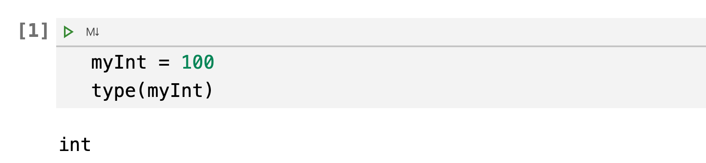
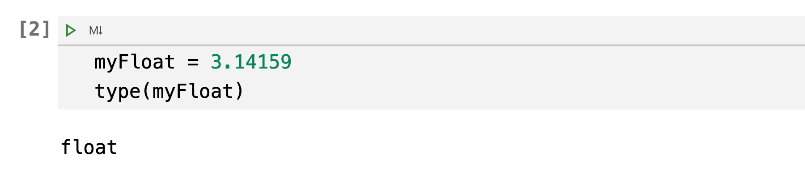
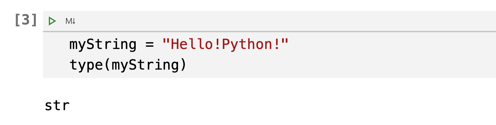
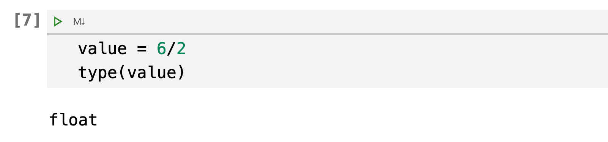
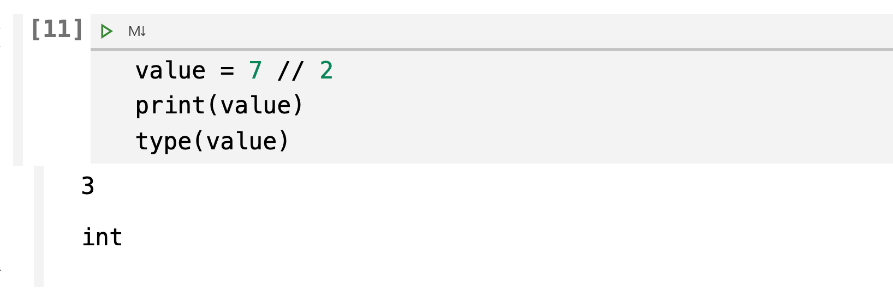
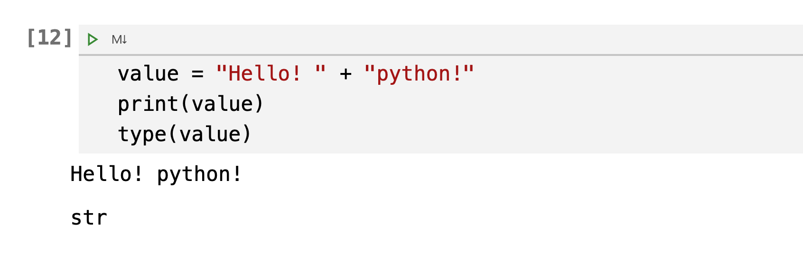
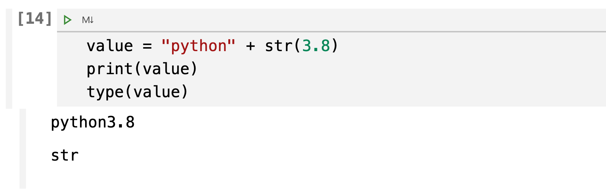
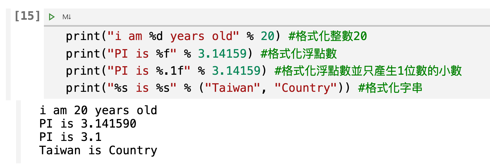

# python內建的4個基本資料類型
在學習python的過程當中，雖說非常的簡單。但當中有一些細節是必需要知道的，而且是在撰寫程式的過程中，你必需要牢記於心中的，就是變數的資料類型(Data Types)。

當在建立一個變數時，開發者必需心中牢記該變數的資料類型，在此就介紹下列4個基本的資類型。

1. int
2. float
3. str
4. bool

使用python內建的function type(), 檢查目前變數的資料型態

```python
type(檢查的項目)
```

## 4種基本資料類型
### 在python內要建立一個變數的方法:變數名稱 + 「 = 」

```python
myInt = xxxx
myFlot = xxxx
myString = xxxx
myBool = xxxxx
```

### int整數型別

```python
myInt = 100
type(myInt)
```

- 小提示:jupyter notebook 每個儲存格會自動輸出最後一行，這範例的最後一行為type(myInt)，將會被自動輸出

執行結果如下:


### float浮點數型別
```python
myFloat = 3.14159
type(myFloat)
```

執行結果如下:


### str字串型別
```python
myString = "Hello!Python!"
type(myString)
```

執行結果如下:


### bool布林型別

```python
myBool = True
type(myBool)
```

執行結果如下:


> 由上述結果可以知道python的變數是依據儲存的內容來決定變數的資料型態

```
100 -> int
100.0 -> float
'Hello!Python' -> str
False -> bool
```

## 數值運算後的資料類型

### 整數和整數的運算
	
```python

value = 40 + 50
type(value)
```

執行結果如下:


### 整數和浮點數的運算

```python
value = 40 + 50.0
type(value)
```

執行結果如下:


### 浮點數除法

```python
value = 6/2
type(value)
```

執行結果如下:



### 整數除法

```
value = 7 // 2
print(value)
type(value)
```

執行結果如下:


- 小提示:整數//整數 -> 整數(去除小數部份) 


## 字串的加法運算

### 字串 + 字串 代表的是串接

```
value = "Hello! " + "python!"
print(value)
type(value)
```

執行結果如下:



### 字串加數值會**出錯**
```python
value = "python" + 3.8
```

執行結果如下:


#### 解法方法-使用str()將數值轉為字串
```python
value = "python" + str(3.8)
print(value)
type(value)
```

執行結果如下:


## 使用字串格式化，讓數值和字串以簡易的方法建立一個全新的字串
- 使用百分比(%)
- 使用format()方法

### 使用百分比(%)
```
語法: 樣板字串 + % + 將格式化的資料
```

```
print("i am %d years old" % 20) #格式化整數20
print("PI is %f" % 3.14159) #格式化浮點數
print("PI is %.1f" % 3.14159) #格式化浮點數並只產生1位數的小數
print("%s is %s" % ("Taiwan", "Country")) #格式化字串
```

執行結果如下:


### 使用format()方法
```
語法: 樣板字串.format(將格式化的資料)
```

```
print("i am {:d} years old".format(20)) #格式化整數20
print("PI is {:f}".format(3.14159)) #格式化浮點數
print("PI is {:.1f}".format(3.14159)) #格式化浮點數並只產生1位數的小數
print("{:s} is {:s}".format("Taiwan", "Country")) #格式化字串
```

執行結果如下:


## 轉換資料型態(轉型)

- int()
- float()
- str()
- bool()

```python
print(int("54")) #轉換字串為整數
print(int(46.57)) #轉換浮點數為整數
print(float("3.14159")) #轉換字串為浮點數
print(str(54)) #轉換整數為字串
print(bool(0)) #轉換整數為布林值
```

執行結果如下:


## 應用以上的技巧 - BMI的計算

```
BMI值計算公式:    
BMI = 體重(公斤) / 身高(公尺)平方
```

```python
name = input('請輸入您的姓名')
height = float(input('請輸入您的身高(cm)'))
weight = float(input('請輸入您的體重(kg)'))
bmi = weight / (height/100) ** 2
print("%s的身高是 %.2f公分" % (name, height))
print("%s的體重是 %.2f公斤" % (name, weight))
print("{:s}的bmi是{:d}".format(name,int(bmi)))
```

執行結果如下:
