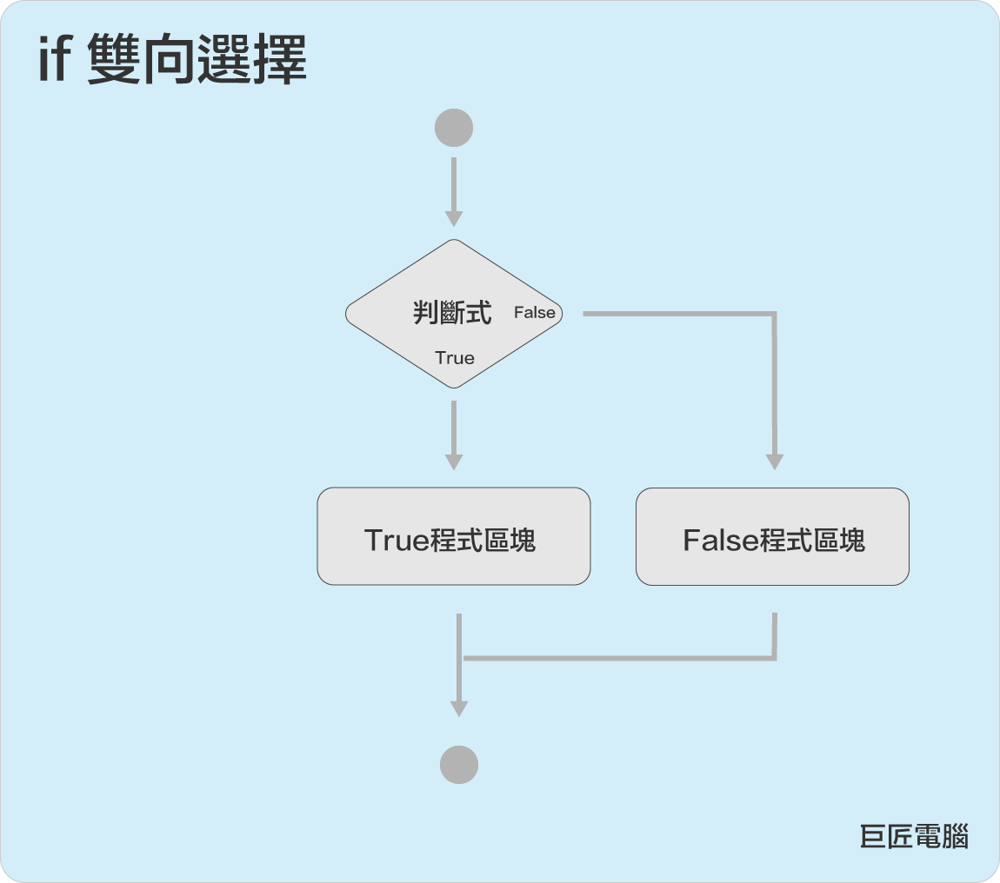
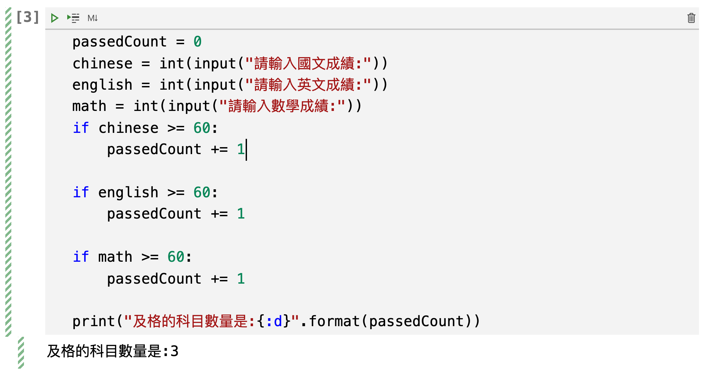

# 4.python流程控制-判斷
在撰寫pyhton程式時，流程控制是學習python的重點之一，所謂流程控制是代表當有多行的程式碼時，我們可以有效的控制程式應該執行的順序和方向，先前章節的程式是由上而下一行一行執行，當學會流程控制後，程式執行將更有變化性。

## `判斷`語法
1. 單向選擇語法: 

```	
if bool:
	True程式區塊
```


2. 雙向選擇語法: 

```	
if bool:
	True程式區塊
else:
	False程式區塊
```



3. 多向選擇語法:

```
if bool:
	程式區塊
elif bool:
	程式區塊
elif bool:
	程式區塊
else:
	程式區塊
```


	
## if敘述
由上方的語法中，可以發現if的後面必需要有boolean值，而這個boolean值就是決定程式執行的方向。

python 的程式區塊必需要小心的地方有:

- 程式區塊內最少要有一行程式
- 程式區塊內沒有限制要有多少行程式
- 程式區塊內必需向內縮排，每一行縮排必需一致(一般都是4個空格)
- 結束程式區塊的方法是結束縮排

## 單向選擇
判斷學生成績及格科目總數量,科目有'國文','英文','數學'

```python
passedCount = 0
chinese = int(input("請輸入國文成績:"))
english = int(input("請輸入英文成績:"))
math = int(input("請輸入數學成績:"))
if chinese >= 60:
    passedCount += 1

if english >= 60:
    passedCount += 1

if math >= 60:
    passedCount += 1

print("及格的科目數量是:{:d}".format(passedCount))
```

執行結果如下: 


## 雙向選擇
判斷學生成績及格或不及格

```python
#700分及格
scores = int(input("請輸入學生總分數"))
if scores >= 700:
    state = '及格'
else:
    state = '不及格'
print('學生總分為{:d},分數:{:s}'.format(scores,state))
```

執行結果如下: 


## 多向選擇
判斷學生的分數等級

| 分數 | 等級 |
|:--|:--|
| 900-1000 | 優等 |
| 800-899 | 甲等 |
| 700-799 | 乙等 |
| 600-699 | 丙等 |
| 0-599 | 丁等 |

```python
scores = int(input('請輸入學生總分數:'))
if scores >= 900:
    state = '優等'
elif scores >= 800:
    state = '甲等'
elif scores >= 700:
    state = '乙等'
elif scores >= 600:
    state = '丙等'
else:
    state = '丁等'
print('學生總分為{:d},分數:{:s}'.format(scores,state))
```

執行結果如下: 


## 應用以上的技巧 - BMI的計算並輸出狀態

```
BMI值計算公式:    
BMI = 體重(公斤) / 身高(公尺)平方
```

| BMI | 狀態 |
|:--|:--|
| <18.5 | 體重過輕 |
|  18.5 <= BMI < 24 | 非常標準 |
|  24 <= BMI < 27 | 過重 |
|  27 <= BMI < 30 | 輕度肥胖 |
|  30 <= BMI < 35 | 中度肥胖 |
|  BMI <= 35 | 重度肥胖 |


```python
name = input('請輸入您的姓名')
height = float(input('請輸入您的身高(cm)'))
weight = float(input('請輸入您的體重(kg)'))
bmi = weight / (height/100) ** 2
print("%s的身高是 %.2f公分" % (name, height))
print("%s的體重是 %.2f公斤" % (name, weight))


if bmi < 18.5:
    state = "體重過輕"
elif bmi < 24:
    state = "非常標準"
elif bmi < 27:
    state = "過重"
elif bmi < 30:
    state = "輕度肥胖"
elif bmi < 35:
    state = "中度肥胖"
else:
    state = "過重"

print("{:s}的bmi是{:d},狀態:{:s}".format(name,int(bmi),state))


```

執行結果如下:


