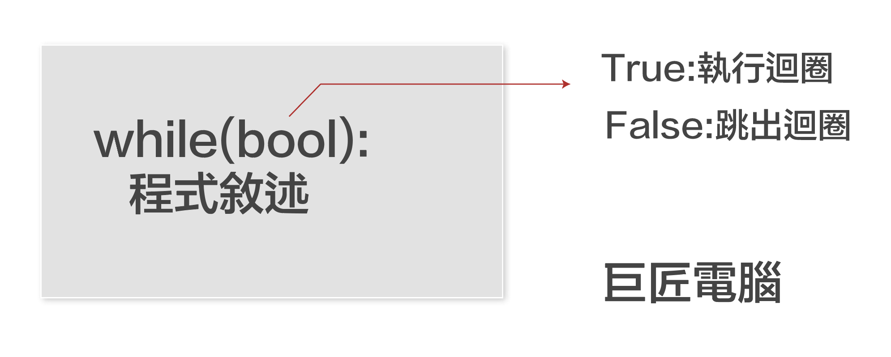

# 5.python流程控制-迴圈
在撰寫pyhton程式時，流程控制是學習python的重點之一，所謂流程控制是代表當有多行的程式碼時，我們可以有效的控制程式應該執行的順序和方向，先前章節的程式是由上而下一行一行執行，當學會流程控制後，程式執行將更有變化性。

## 迴圈
當有一個程式區塊，因為程式的需求，必需要執行1次以上時，這時就非常適合使用迴圈，讀者會覺得何時才有這樣的需求要執行多次呢?後面將會有實際範例來展示在何種情境下要程式區塊必需重覆執行多次

## 迴圈必需要注意的2個重點是:
1. 確定執行次數的迴圈
2. 不確定執行次數的迴圈

## 確定執行次數的迴圈
所謂確定執行次數，就是很明確的知道要執行幾次程式區塊
### 使用for_in迴圈和range()函式

#### range()函式語法: 

`range(start, stop[, step])`

#### range()使用語明:

1. range(5) -> 代表0, 1, 2, 3, 4
2. range(1,5) -> 代表1, 2, 3, 4
3. range(1,10,2) -> 代表1, 3, 5, 7, 9

#### for_in 語法: for 變數 in range()

- 變數的名稱可以自已隨便定義

```python
#執行5次,i的值依序為0,1,2,3,4
for i in range(5):
    print(i)

輸出:
0
1
2
3
4
```

```python
#執行4次,i的值依序為1,2,3,4
for j in range(1,5):
    print(j)
    
輸出:
1
2
3
4
```

```python
#執行5次,i的值依序為1,3,5,7,9
for j in range(1,10,2):
    print(j)

輸出:
1
3
5
7
9
```

### while()迴圈，執行固定次數的語法

語法:如下圖:


說明:

	- 3個步驟，1個都不可以少
	- 第1步驟:先初始化一個變數i
	- 第2步驟:在while後面建立Bool值，如果是True，執行程式區塊，如果是False，跳出程式區塊
	- 第3步驟: 改變i的數值
	
	
```python
i = 0
while(i<5):
    print(i)
    i += 1

輸出:
0
1
2
3
4
```

```python
s = 5
while(s > 0):
    print(s)
    s -= 1

輸出:
5
4
3
2
1
```

### 範例:固定執行次數的迴圈
輸出九九乘法表

```python
for i in range(1,10):
    for j in range(1, 10):
        print('%-2d * %2d = %2d' % (i, j, i*j), end='  ')
    print()
```


#### 範例說明:
i = 1 時  j=1-9

i = 2 時  j=1-9

...

字串格式化的2d,代表空間佔2字元位置大小

字串格式他的-2d,代表空間佔2字元位置大小,文字靠左
	

## 不確定執行次數的迴圈
所謂不確定執行次數，就是不知道要執行幾次程式區塊，只有在相關的條件符合時，才會跳出迴圈，設計這種迴圈是必需注意的是不要造成`無限迴圈`

### 語法:如下圖



```python
name = ''
while name != '0':
    name = input('請輸入姓名:[輸入0,停止輸入]')
    print("Hello! %s" % name)
    
輸出:
Hello! robert
Hello! jenny
Hello! Alice
Hello! 0
```

### 使用break,強制跳出迴圈

```python
while True:
    name = input('請輸入姓名:[輸入0,停止輸入]')
    if name == '0':
        break
    print("Hello! %s" % name)

輸出:
Hello! robert
Hello! jenny
Hello! alice
```

## 實際案例 - BMI的計算並輸出狀態，持續運算，直到使用者停止計算

```
BMI值計算公式:    
BMI = 體重(公斤) / 身高(公尺)平方
```

| BMI | 狀態 |
|:--|:--|
| <18.5 | 體重過輕 |
|  18.5 <= BMI < 24 | 非常標準 |
|  24 <= BMI < 27 | 過重 |
|  27 <= BMI < 30 | 輕度肥胖 |
|  30 <= BMI < 35 | 中度肥胖 |
|  BMI <= 35 | 重度肥胖 |


```python

while True:
    height = float(input('請輸入您的身高(cm)'))
    weight = float(input('請輸入您的體重(kg)'))
    bmi = weight / (height/100) ** 2
    print("身高是 %.2f公分" % (height))
    print("體重是 %.2f公斤" % (weight))


    if bmi < 18.5:
        state = "體重過輕"
    elif bmi < 24:
        state = "非常標準"
    elif bmi < 27:
        state = "過重"
    elif bmi < 30:
        state = "輕度肥胖"
    elif bmi < 35:
        state = "中度肥胖"
    else:
        state = "過重"

    print("您的bmi是{:d},狀態:{:s}".format(int(bmi),state))
    answer = input("請問還要繼續運算BMI嗎?[繼續請按'Y',停止請按任意鍵]")
    if answer.upper() != 'Y':       
        break
    print("-----------------------")
print("程式結束")    

輸出:
身高是 178.00公分
體重是 67.00公斤
您的bmi是21,狀態:非常標準
-----------------------
身高是 160.00公分
體重是 45.00公斤
您的bmi是17,狀態:體重過輕
-----------------------
身高是 172.00公分
體重是 85.00公斤
您的bmi是28,狀態:輕度肥胖
程式結束
```


