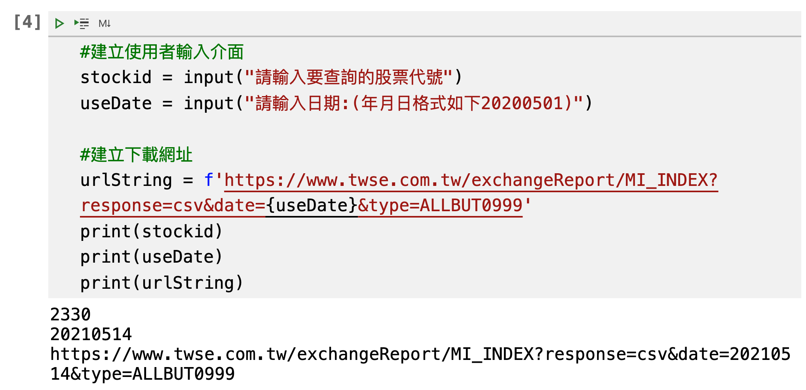
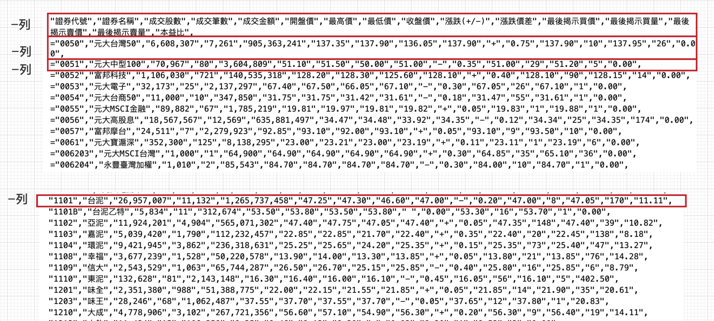
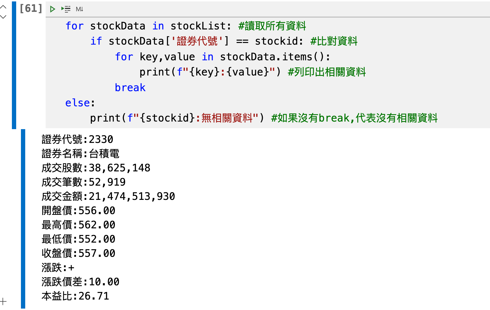

# 9.爬取台股每日資訊(使用python基本資料結構)
## 透過臺灣證券交易所取得報表資料
- 目標為取得下載的網址

### 依照下圖，依序說明如何取得下載的網址


#### 1. 進入https://www.twse.com.tw/zh/網站，依順序找到交易資訊->盤後資訊->每日收盤行情

#### 2. 查詢全部(不含權證，牛熊證，可展延牛熊證),按下查訊

#### 3. 打開chrome開發者工具(按F12), 選取Elements

#### 4. 使用元素選取工具

#### 5. 選取CSV下載按鈕

#### 6. 觀查下載的網址href屬性後的資訊


1.透過/exchangeReport,知道網址為https://www.twse.com.tw/exchangeReport

2.日期格式，表示可以查詢指定日期的台股資訊

#### 7. 下載網址:https://www.twse.com.tw/exchangeReport/MI_INDEX?response=csv&date=20210514&type=ALLBUT0999
 

## 透過excel或number觀察csv內的資訊內容, 查詢每一個欄位所代表的資訊


### 依序是:證券代號-證券名稱-成交股數-成交筆數-成交金額-開盤價-最高價	-最低價-收盤價-漲跌(+/-)	-漲跌價差-最後揭示買價-最後揭示買量-最後揭示賣價-最後揭示賣量-本益比

## 使用 vscode 建立sample.ipynb檔案，建立簡易詢問介面

```python
#建立使用者輸入介面
stockid = input("請輸入要查詢的股票代號")
useDate = input("請輸入日期:(年月日格式如下20200501)")

#建立下載網址
urlString = f'https://www.twse.com.tw/exchangeReport/MI_INDEX?response=csv&date={useDate}&type=ALLBUT0999'
print(stockid)
print(useDate)
print(urlString)
```




## 安裝requests擴充套件

- 開啟vscode的Terminal -> new Terminal功能

```
$ pip install requests
```

## 下載資料並取得所有csv文字內容

```python
#將csv內容轉換為可以IO存取內容
import requests
response = requests.post(urlString)
if response.status_code == 200:
    content = response.text
print(content)
```


## 觀察csv內容
#### 1. 在欄位[0]時是證券後的資料才是我們要的資料
#### 2. 所有欄位都是字串
#### 3. 台泥證券代號是正常的字串"1101"



## 收集相關的內容
- 要收集證券代號'1101'以後的內容

```python
#使用csv套件讀取內容
import csv
printData = False #判斷是否為我們要的資料
csvReaders = csv.reader(content_io) #建立csv的reader
stockList = [] #建立專門要收集資料的list

for row in csvReaders: #一列一列讀取資料
    if len(row) > 0 and row[0] == '1101': #只有該列有資料，並且第一欄為'1101'時，才開始收集資料
        printData = True   
    
    if printData: #開始收集資料
        stockList.append({"證券代號":row[0],"證券名稱":row[1],"成交股數":row[2],"成交筆數":row[3],"成交金額":row[4],"開盤價":row[5],"最高價":row[6],"最低價":row[7], "收盤價":row[8], "漲跌":row[9], "漲跌價差":row[10], "本益比":row[15]})
        

print(stockList)
```

> 注意:
> content_io的內容只可以讀取一次，讀完後資料內容就會清空


## 取出使用者想要的內容,並列印出該股票相關資訊

```python
for stockData in stockList: #讀取所有資料
    if stockData['證券代號'] == stockid: #比對資料
        for key,value in stockData.items():
            print(f"{key}:{value}") #列印出相關資料
        break
else:
    print(f"{stockid}:無相關資料") #如果沒有break,代表沒有相關資料
```





