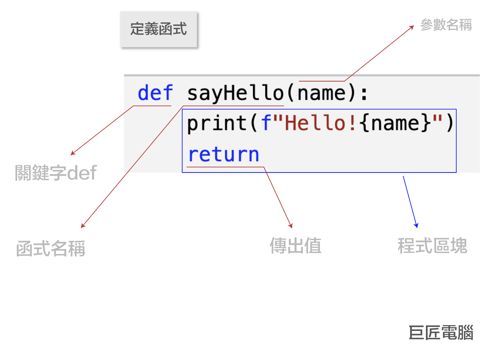
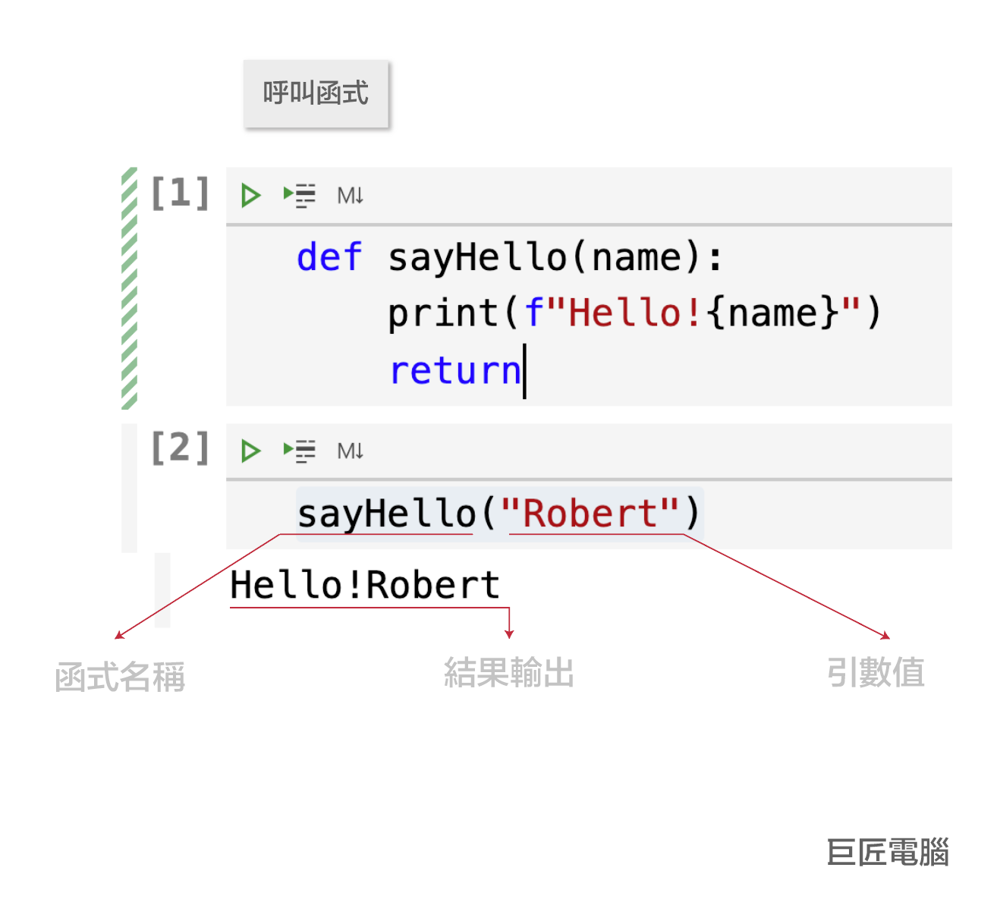
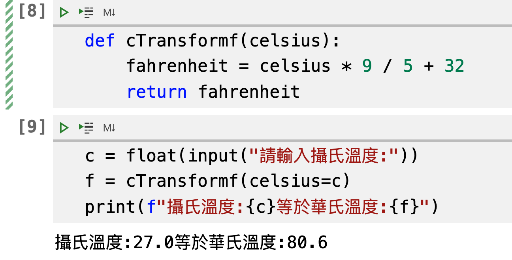

# 7.python函式
函式的功能是可以讓整個應用程式的架構更為簡捷和清楚，對於開發者而言，可以提升思考邏輯，還有一些應用程式會重複性使用的功能，也可以自訂一個函式(function)

其實先前早已經大量使用python內建的函式，比如print(),input()函式，只是這些函式是由python內建的，而非自訂的函式

## 自訂函式的主要功能:

1. 重覆使用的功能
2. 建立應用程式有規則性的架構，讓未來維護會更加容易

## 自訂函式可以分成2個部份:

1. 定義函式
2. 呼叫函式

### 定義函式的語法:
- 下面為定義一個自訂的函式的語法
- 函式名稱為sayHello
- 參數名稱為name
- 主要功能為列印出"Hello!人名"
- 沒有傳出任何值
- 程式區塊必需縮排


####  語法說明:



### 呼叫函式的2種語法:

#### 1. 沒有使用引數名稱的呼叫法:

```python
def sayHello(name):
    print(f"Hello!{name}")
    return

#呼叫
sayHello("Robert") 

輸出結果==================
Hello!Robert
```



#### 2. 使用引數名稱的呼叫法:

```python
def sayHello(name):
    print(f"Hello!{name}")
    return

#呼叫
sayHello(name="Robert") 

輸出結果==================
Hello!Robert
```


### 簡單範例

- 建立一個攝氏溫度轉為華式溫度的的函式

```python
def cTransformf(celsius):
    fahrenheit = celsius * 9 / 5 + 32
    return fahrenheit
    
c = float(input("請輸入攝氏溫度:"))
f = cTransformf(celsius=c)
print(f"攝氏溫度:{c}等於華氏溫度:{f}")

輸出結果:
攝氏溫度:27.0等於華氏溫度:80.6
```



## 實際案例 - BMI的計算並輸出狀態，持續運算，直到使用者停止計算，使用函式功能

```
BMI值計算公式:    
BMI = 體重(公斤) / 身高(公尺)平方
```

| BMI | 狀態 |
|:--|:--|
| <18.5 | 體重過輕 |
|  18.5 <= BMI < 24 | 非常標準 |
|  24 <= BMI < 27 | 過重 |
|  27 <= BMI < 30 | 輕度肥胖 |
|  30 <= BMI < 35 | 中度肥胖 |
|  BMI <= 35 | 重度肥胖 |


```python

def bmiCaculator(height, weight):
    bmi = weight / (height/100) ** 2
    if bmi < 18.5:
        state = "體重過輕"
    elif bmi < 24:
        state = "非常標準"
    elif bmi < 27:
        state = "過重"
    elif bmi < 30:
        state = "輕度肥胖"
    elif bmi < 35:
        state = "中度肥胖"
    else:
        state = "過重"

    return bmi,state


while True:
    h = float(input('請輸入您的身高(cm)'))
    w = float(input('請輸入您的體重(kg)'))
    bmi,state = bmiCaculator(height=h,weight=w)
    print("身高是 %.2f公分" % (h))
    print("體重是 %.2f公斤" % (w))
    print("您的bmi是{:d},狀態:{:s}".format(int(bmi),state))
    answer = input("請問還要繼續運算BMI嗎?[繼續請按'Y',停止請按任意鍵]")
    if answer.upper() != 'Y':       
        break
    print("-----------------------")
print("程式結束")

輸出:==================
身高是 178.00公分
體重是 67.00公斤
您的bmi是21,狀態:非常標準
-----------------------
身高是 160.00公分
體重是 45.00公斤
您的bmi是17,狀態:體重過輕
-----------------------
身高是 172.00公分
體重是 85.00公斤
您的bmi是28,狀態:輕度肥胖
程式結束
```


