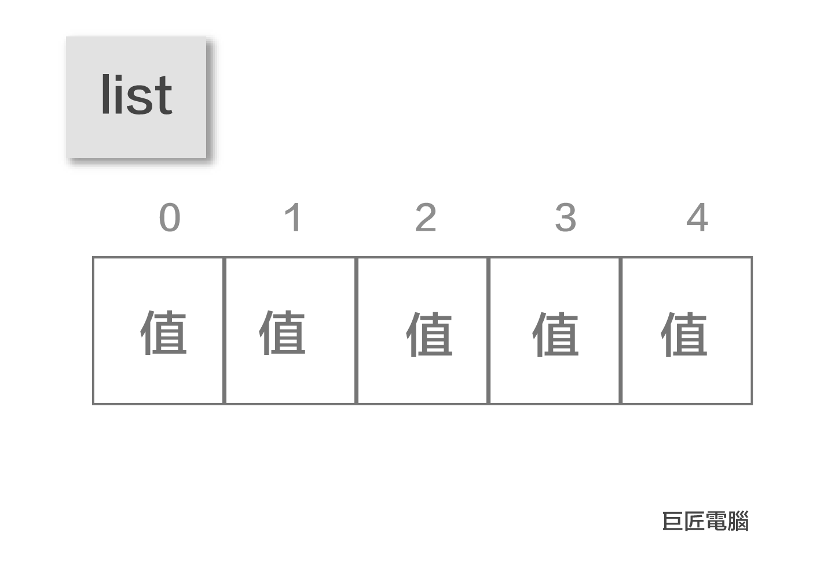
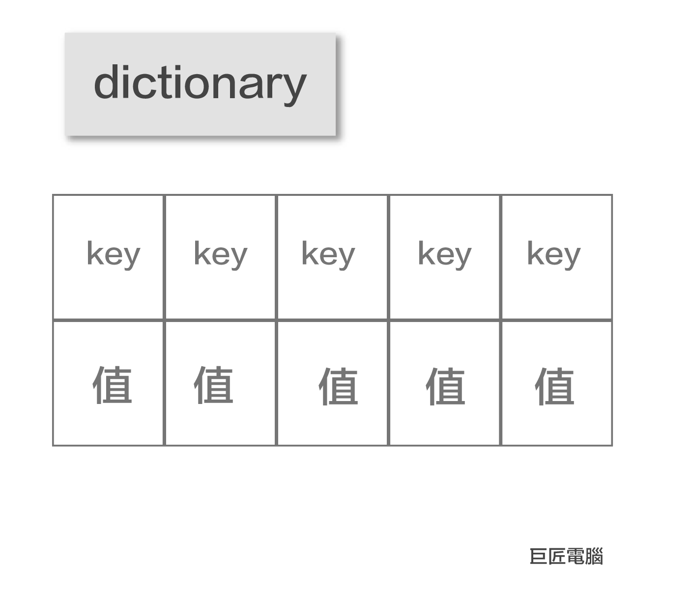
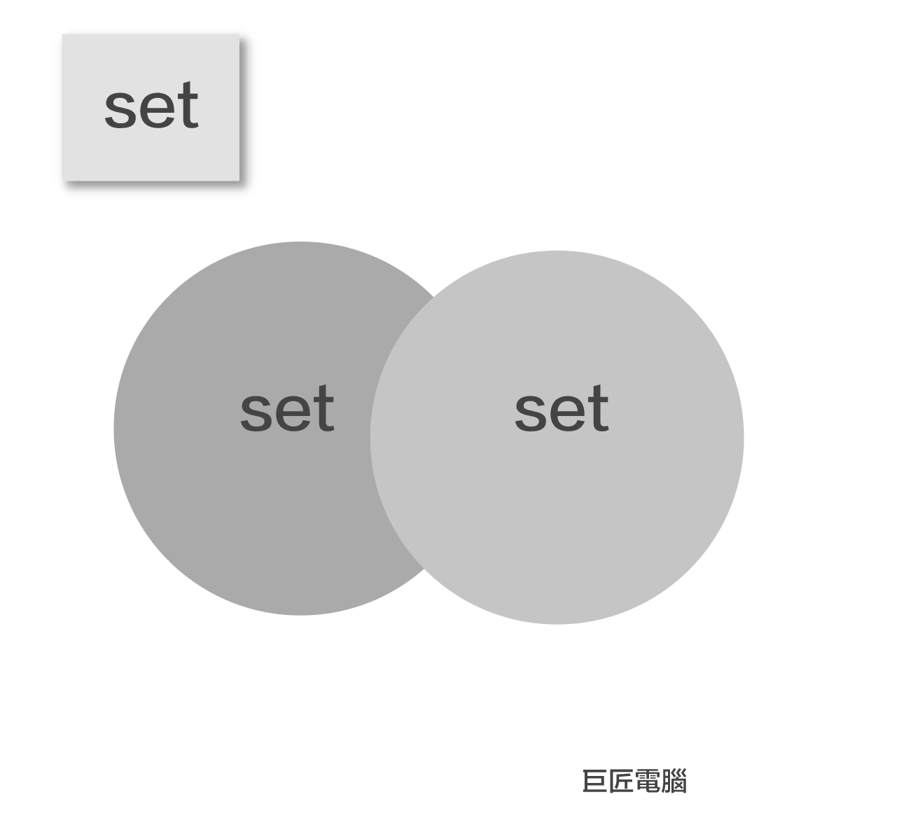
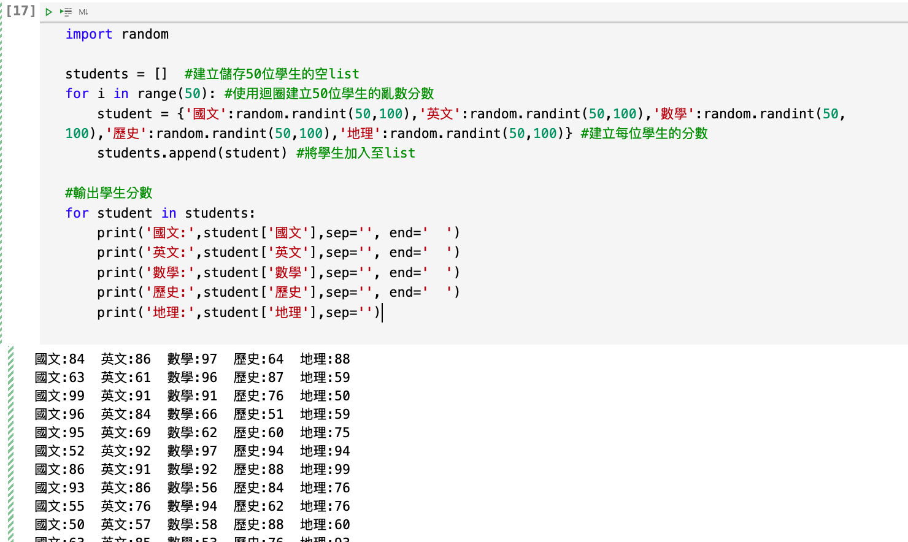

# 6.python資料結構
先前所學習的變數，僅可以儲存一個值，這將造成撰寫程式的不方便，比如說要紀錄一個班級所有學生的分數，一個班級有50位學生，一位學生有5個分數，此時需要建立250個變數，而且每個變數必需有不同的名稱。

要解決以上的問題，就必需使用python的資料結構來解決以上的問題。後面我們將會有實際案例來說明資料結構的重要性和必要性

## python的4種資料結構類型:
1. tuple
2. list
3. dictionary
4. set

## 2. tuple


### tuple的特質

- 是有順序的
- 內容無法更改

### tuple建立語法

- 以小括號表示

```
(3, 5, 7, 9)
('商店','便利店','百貨公司')
```


## 2. list



### list的特質

- 是有順序的
- 可以編輯新增和修改

### list建立語法

- 以中括號表示

```
[3, 5, 7, 9]
['商店','便利店','百貨公司']
```


## 3. dictionary



- 無順序
- 每一組是key和value的組合

### dictionary建立語法

- {key:value,key:value}

```
{3:'three', 5:'five', 7:'seven', 9:'nine'}
{'store':'商店','convenient':'便利店','department':'百貨公司'}
```


## 4. set



- 無順序
- 組合內不可以有相同元素
- 組合和組合可以做集合運算

### set建立語法

- {value,value,value}

```
{3, 5, 7, 9}
{'商店','便利店','百貨公司'}
```

## 建立學生的5科分數

### 使用tuple

```
student_tuple = (67, 89, 74, 87, 75)
student_tuple

輸出結果:=======
(67, 89, 74, 87, 75)
```

### 使用list

```
student_list = [67, 89, 74, 87, 75)
student_list

輸出結果:=======
[67, 89, 74, 87, 75]
```

### 使用dictionary

```
student_dict = {'國文':67,'英文':89,'數學':74,'歷史':87,'地理':75}
student_dict

輸出結果:=======
{'國文': 67, '英文': 89, '數學': 74, '歷史': 87, '地理': 75}
```

## 取出學生的5科分數

### 使用tuple取出

```
chinese,english,math,history,geographic = student_tuple
print('國文',chinese)
print('英文',english)
print('數學',math)
print('歷史',history)
print('地理',geographic)
    
輸出結果:=======
國文 67
英文 89
數學 74
歷史 87
地理 75    
```

### 使用list取出

```
chinese = student_list[0]
english = student_list[1]
math = student_list[2]
history = student_list[3]
geographic = student_list[4]

print('國文',chinese)
print('英文',english)
print('數學',math)
print('歷史',history)
print('地理',geographic)
    
輸出結果:=======
國文 67
英文 89
數學 74
歷史 87
地理 75   
```

### 使用dictionary取出

```
hinese = student_dict['國文']
english = student_dict['英文']
math = student_dict['數學']
history = student_dict['歷史']
geographic = student_dict['地理']

print('國文',chinese)
print('英文',english)
print('數學',math)
print('歷史',history)
print('地理',geographic)

輸出結果:=======
國文 67
英文 89
數學 74
歷史 87
地理 75   
```

### 使用for _ in 迴圈取出list資料

```
for i in student_list:
    print(i)

輸出結果:=======
67
89
74
87
75
```

### 使用for_in迴圈取出dictionary資料

```
for key,value in student_dict.items():
    print(key,value)
    
輸出結果:=======
國文 67
英文 89
數學 74
歷史 87
地理 75
```


## 實際案例:
- 建立50位學生
- 使用亂數建立5科分數
- 輸出所有學生分數

```
import random

students = []  #建立儲存50位學生的空list
for i in range(50): #使用迴圈建立50位學生的亂數分數
    student = {'國文':random.randint(50,100),'英文':random.randint(50,100),'數學':random.randint(50,100),'歷史':random.randint(50,100),'地理':random.randint(50,100)} #建立每位學生的分數
    students.append(student) #將學生加入至list

#輸出學生分數
for student in students:
    print('國文:',student['國文'],sep='', end='  ')
    print('英文:',student['英文'],sep='', end='  ')
    print('數學:',student['數學'],sep='', end='  ')
    print('歷史:',student['歷史'],sep='', end='  ')
    print('地理:',student['地理'],sep='')
    
輸出結果:=======
國文:84  英文:86  數學:97  歷史:64  地理:88
國文:63  英文:61  數學:96  歷史:87  地理:59
國文:99  英文:91  數學:91  歷史:76  地理:50
國文:96  英文:84  數學:66  歷史:51  地理:59
國文:95  英文:69  數學:62  歷史:60  地理:75
國文:52  英文:92  數學:97  歷史:94  地理:94
國文:86  英文:91  數學:92  歷史:88  地理:99
國文:93  英文:86  數學:56  歷史:84  地理:76
國文:55  英文:76  數學:94  歷史:62  地理:76
國文:50  英文:57  數學:58  歷史:88  地理:60
國文:63  英文:85  數學:53  歷史:76  地理:93
國文:91  英文:75  數學:85  歷史:87  地理:62
國文:67  英文:71  數學:90  歷史:63  地理:58
國文:71  英文:98  數學:60  歷史:82  地理:78
國文:96  英文:93  數學:54  歷史:66  地理:60
國文:59  英文:82  數學:93  歷史:52  地理:97
國文:75  英文:89  數學:50  歷史:64  地理:64
國文:76  英文:90  數學:89  歷史:97  地理:96
國文:51  英文:78  數學:77  歷史:93  地理:61
國文:54  英文:59  數學:62  歷史:97  地理:76
國文:84  英文:95  數學:84  歷史:69  地理:54
國文:59  英文:78  數學:82  歷史:91  地理:95
國文:92  英文:71  數學:64  歷史:81  地理:81
國文:82  英文:76  數學:90  歷史:68  地理:83
國文:68  英文:62  數學:87  歷史:91  地理:78
國文:77  英文:87  數學:59  歷史:100  地理:91
國文:93  英文:90  數學:83  歷史:65  地理:54
國文:63  英文:54  數學:92  歷史:73  地理:67
國文:54  英文:68  數學:50  歷史:79  地理:66
國文:56  英文:59  數學:71  歷史:94  地理:93
國文:96  英文:54  數學:74  歷史:81  地理:86
國文:77  英文:77  數學:62  歷史:79  地理:84
國文:57  英文:50  數學:51  歷史:98  地理:50
國文:59  英文:77  數學:58  歷史:98  地理:65
國文:62  英文:86  數學:99  歷史:100  地理:71
國文:59  英文:62  數學:59  歷史:91  地理:50
國文:72  英文:89  數學:52  歷史:66  地理:90
國文:74  英文:82  數學:64  歷史:79  地理:52
國文:76  英文:99  數學:91  歷史:59  地理:50
國文:63  英文:95  數學:83  歷史:80  地理:72
國文:79  英文:70  數學:75  歷史:58  地理:86
國文:90  英文:72  數學:65  歷史:95  地理:81
國文:63  英文:89  數學:75  歷史:91  地理:90
國文:78  英文:100  數學:90  歷史:92  地理:100
國文:89  英文:96  數學:66  歷史:68  地理:51
國文:61  英文:67  數學:80  歷史:99  地理:88
國文:66  英文:84  數學:76  歷史:79  地理:67
國文:71  英文:78  數學:65  歷史:96  地理:52
國文:80  英文:71  數學:78  歷史:67  地理:69
國文:62  英文:61  數學:89  歷史:69  地理:100
```




