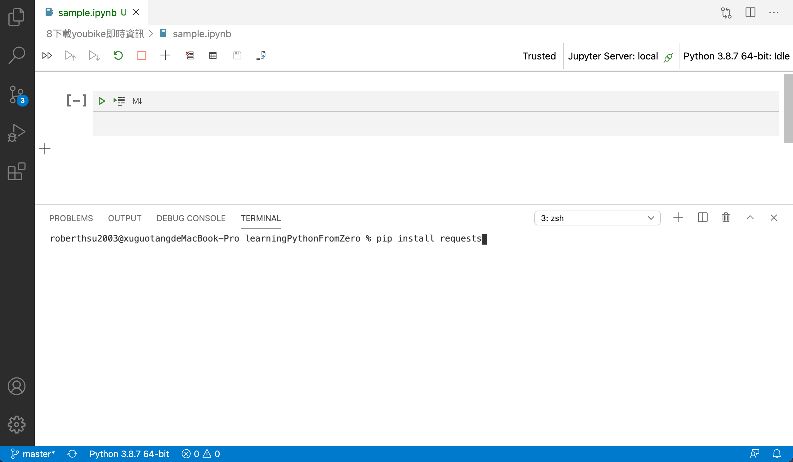
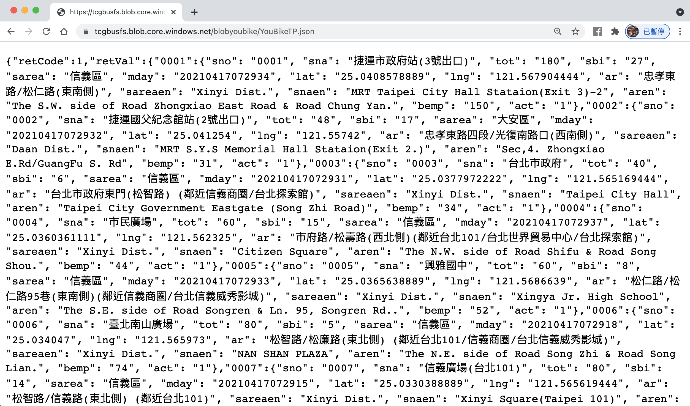
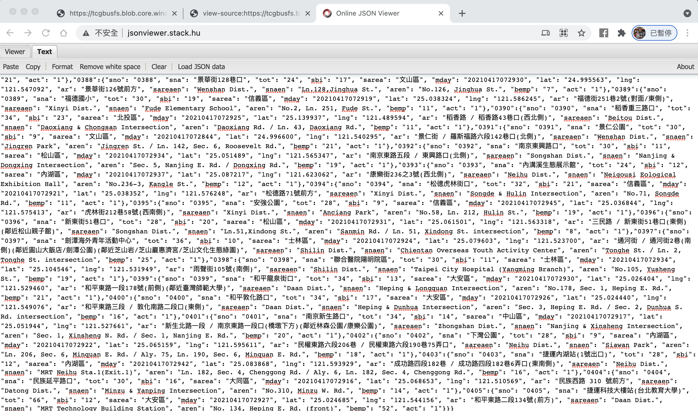
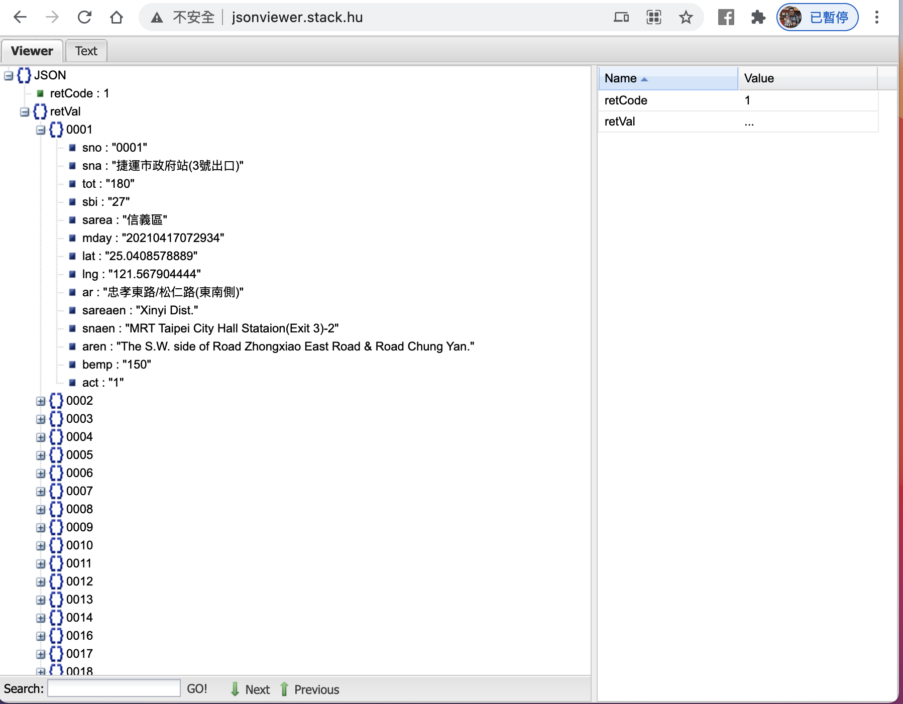
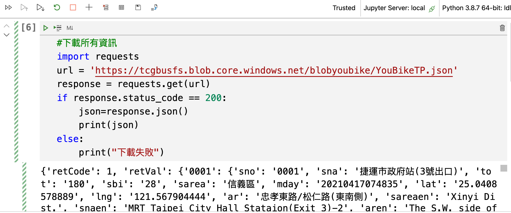
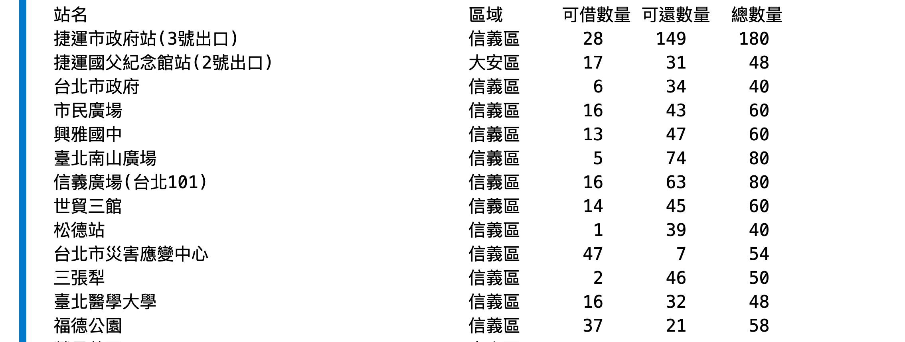
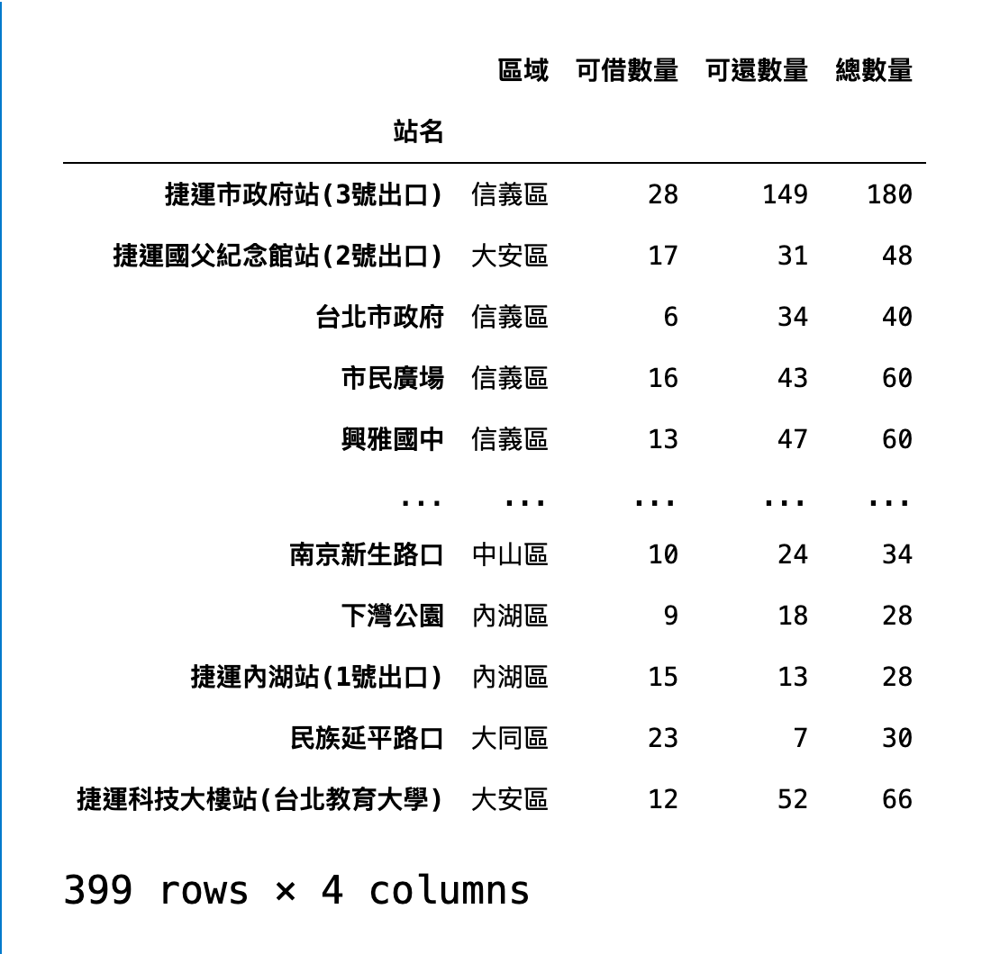

# 8.python網路應用
## 下載youbike即時資訊
透過政府開放平台，取得YouBike臺北市公共自行車即時資訊。

| 檔案名稱 | 介接網址 | 主要欄位說明 |
|:--|:--|:--|
| YouBike臺北市公共自行車即時資訊(JSON檔) | https://tcgbusfs.blob.core.windows.net/blobyoubike/YouBikeTP.json | sno(站點代號)、sna(場站中文名稱)、tot(場站總停車格)、sbi(場站目前車輛數量)、sarea(場站區域)、mday(資料更新時間)、lat(緯度)、lng(經度)、ar(地點)、sareaen(場站區域英文)、snaen(場站名稱英文)、aren(地址英文)、bemp(空位數量)、act(全站禁用狀態) |

## 安裝requests擴充套件

- 開啟vscode的Terminal -> new Terminal功能

```
$ pip install requests
```



## 檢視json資料結構

1. 使用chrome,開啟介接網址



2. 複制json文字
3. 使用網站工具[Online JSON Viewer](http://jsonviewer.stack.hu/),並貼上json文字至文字區



4.點選Viewer, 檢視json資料結構

- 所有資料位於retVal節點



## 下載資料

```python
#下載所有資訊
import requests
url = 'https://tcgbusfs.blob.core.windows.net/blobyoubike/YouBikeTP.json'
response = requests.get(url)
if response.status_code == 200:
    json=response.json()
    print(json)
else:
    print("下載失敗")
```



## 取出所有站點資訊

```python
allData = list(json["retVal"].values())
allData
```


## 列印表格化資訊

```python
print("{:<30s}\t\t{:<3s}\t{:>5s}{:>5s}{:>5s}".format("站名","區域","可借數量","可還數量","總數量"))
for site in allData:
    siteName = site["sna"]
    area = site["sarea"]
    sbi = site["sbi"]
    bemp = site["bemp"]
    total = site["tot"]
    print("{:<30s}\t{:<3s}\t{:>5s}\t{:>5s}\t{:>5s}".format(siteName,area,sbi,bemp,total))
```



## 使用pandas

1. 安裝pandas

```
$ pip install pandas
```

2.建立表格資料

```python
import pandas as pd
dataFrame = pd.DataFrame(allData,columns=['sna','sarea','sbi','bemp','tot'])
dataFrame.columns = ["站名","區域","可借數量","可還數量","總數量"]
dataFrame.set_index('站名',inplace=True)
dataFrame
```




