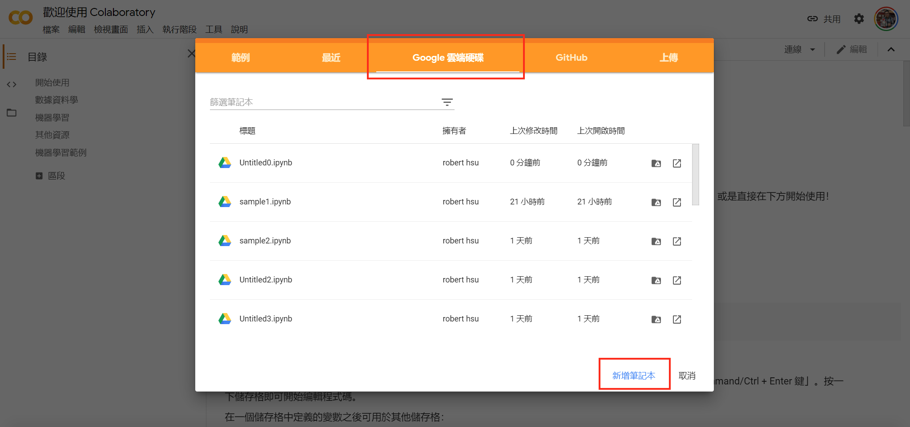
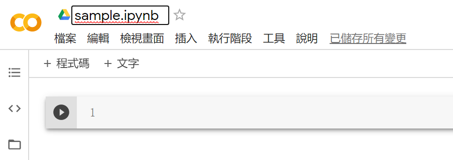
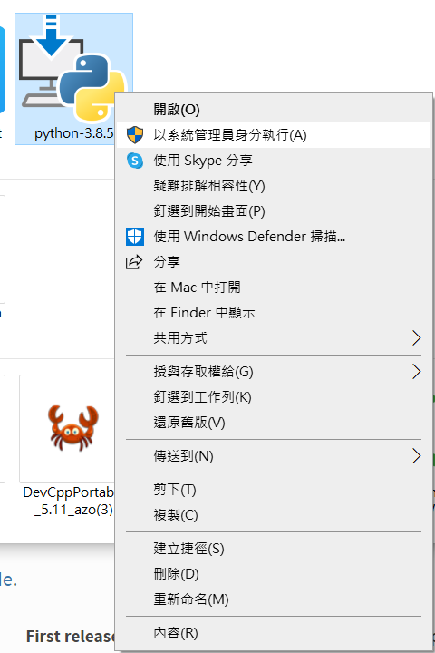
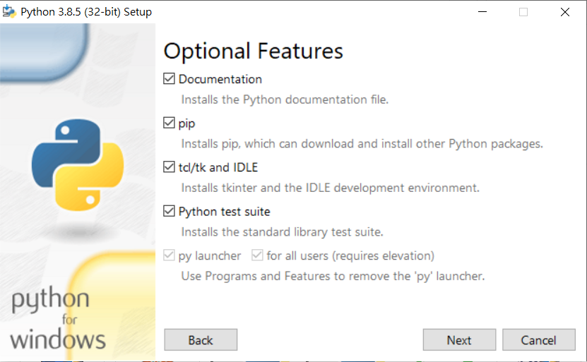
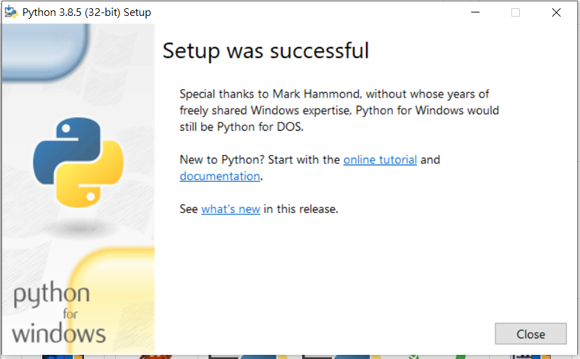
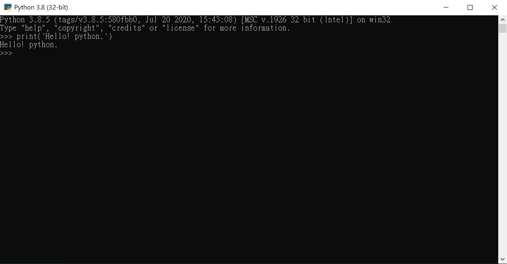
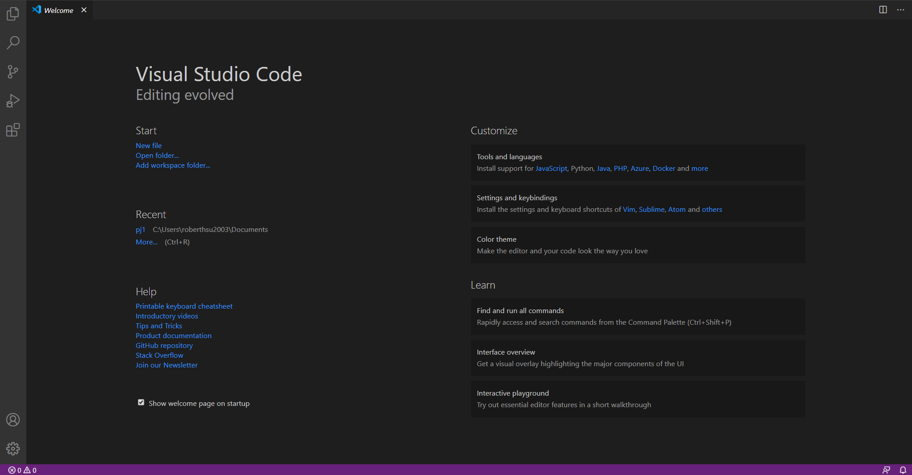
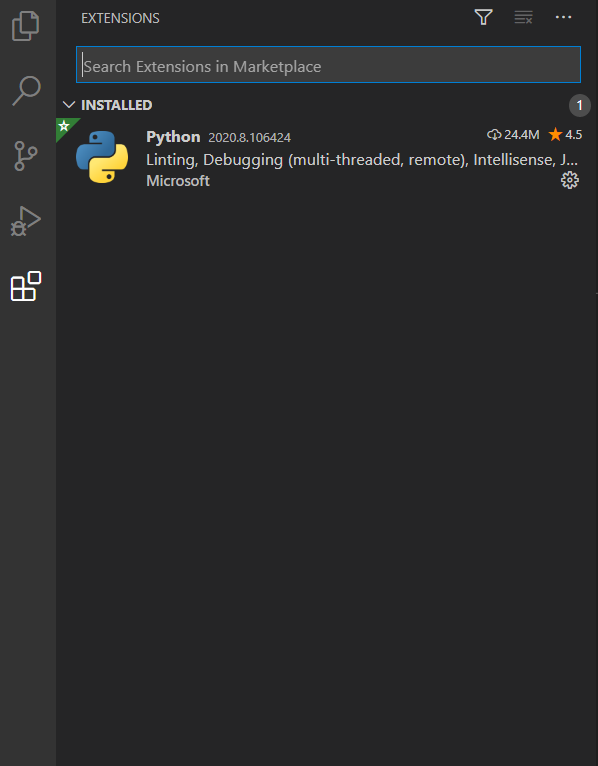
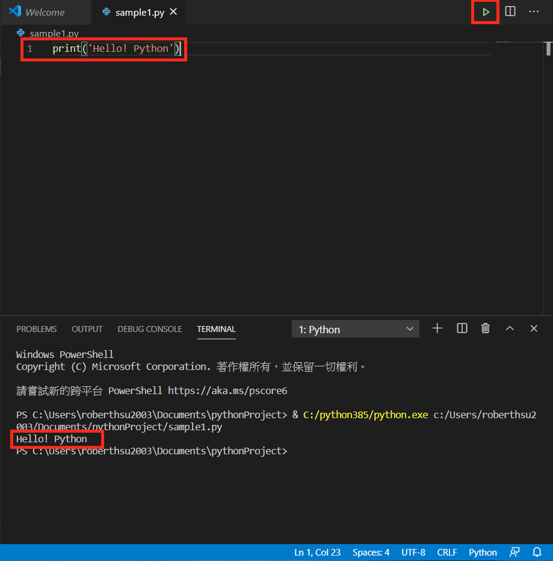

# Python 開發環境完整安裝指南

要學習 Python 程式語言前，必需要有一套編輯器，才有辦法學習 Python。本指南將教各位完整的安裝方式，包含以下內容：

## 📚 學習目標

本指南包含 5 個部分：

1. **使用 Google Colab 雲端編輯器**
   只要有瀏覽器（建議使用 Chrome），就可以開始編寫 Python，是最無痛最簡單的方式。

2. **安裝本地 Python 環境**
   在您的電腦上安裝 Python，適合進階學習和離線使用。

3. **安裝 VS Code 編輯器**
   免費且功能強大的程式碼編輯器，支援 Python 開發。

4. **安裝 Git 版本控制系統**
   學習使用 Git 管理程式碼，並完成 Git 的初始化設定。

5. **安裝 UV 套件管理工具**
   現代化的 Python 套件管理工具，比 pip 更快速，並完成 UV 的初始化。

---


### 1.使用雲端編輯器Colab
	1.1 打開chrome,並搜尋google Colab,或直接點進官網https://colab.research.google.com
	1.2 按右上角的「登入按鈕」,並使用自已的google帳號登入
	1.3 點選「google雲端硬碟」,並按下「新增筆記本」按鈕。如下圖1-1: 


	
	1.4 更改左上角檔案名稱「xxx.ipynb」,檔案將儲存在google drive雲端硬碟內.如下圖1-2
	


	1.5 在儲存格內輸入,並按下「shift + enter」
	>>> print('Hello! python.')
	Hello! python.
	代表一切都完成了，可以放心學習python語言。如下圖1-3
	


---

### 2.安裝本地電腦端 Python
	2.1 至 python 官網 (https://www.python.org) 下載最新版本 python3.x 安裝檔（建議 3.10 版以上）。如圖 2-1:


	2.2 下載安裝時，將是一個重要的階段，中間安裝錯誤，將會使 python 部份功能無法正常執行。將選取 python-3.x.x 執行檔並按下右鍵以系統管理員身份執行。如圖 2-2



	2.3 **重要！「Add Python 3.x to PATH」請務必打勾**，並且選擇自訂安裝（Customize installation）。如圖 2-3


	2.4 選擇功能頁面建議全部打勾。如圖 2-4



	2.5 進階功能頁面安裝的部份選擇預設，不需更改，但要選擇自訂的資料夾，以利未來的管理，點選「Browse」按鈕。如圖 2-5:


	2.6 請在 C 硬碟內，建立一個新的資料夾，命名為 python312（任何名稱皆可以，以可以快速知道版本為最佳的命名方式），並點選 C 硬碟後，再點選 python312 的資料夾，讓資料夾的輸入欄內出現 python312，這裏常出錯誤，請務必小心。如圖 2-6


	2.7 安裝完成後，請按下「Close」按鈕。如圖 2-7



	2.8 在 Windows 的搜尋輸入 python，選取 python 3.x 應用程式，並以系統管理員身分執行。如圖 2-8


	2.9 在 python 3.x 應用視窗內，輸入
	>>> print('Hello! python.')
	Hello! python.

	代表已經安裝成功。如圖 2-9



	2.10 驗證 pip 套件管理工具
	開啟命令提示字元（CMD）或 PowerShell，輸入：
	```
	python --version
	pip --version
	```
	如果都能正常顯示版本資訊，代表安裝完全成功。

---

### 3.使用免費編輯器VS Code當作編輯器
	3.1 下載VS Code(https://code.visualstudio.com/).如圖3-1
	


	3.2 執行VS Code安裝程式
	3.3 安裝過程皆使用預設設定，按下一步來完成完整安裝
	3.4 開始virtual studio code應用程式.如圖3-2
	


	3.5 安裝python extensions,點選extensions,搜尋python,並且安裝python extension.如圖3-3


	3.6 安裝完extensions的畫面.如圖3-4.
	

	
	3.7 從file->open Foler, 在文件目錄內,建立一個專案pythonProject 資料夾,並選擇該資料夾。如圖3-5.
	


	3.8 在pythonProject目錄內,建立sample1.py檔案, 並按下enter,過程中如果自動要安裝其它應用程式請按yes。如圖3-6


	3.9 請輸入print('Hello! python.'),並按下右上角的執行,下方TERMINAL出現Hello! python,代表安裝完成.如圖3-7
	


	3.10 請建立sample1.ipynb的jupyter notebook檔案,建立過程中如果右下角要求您安裝其它軟體,請按下「yes」.如圖3-8
	


	3.11 在儲存格內輸入print('Hello! python.'), 並按下右邊的執行按鈕,出現 Hello! python.,代表jupyter notebook也安裝成功,此時的功能將和雲端colab的畫面相似.如圖3-9
	


---

### 4.安裝 Git 版本控制系統和初始化

Git 是現代軟體開發必備的版本控制工具，可以追蹤程式碼的變更歷史。

#### 4.1 下載並安裝 Git

	4.1.1 前往 Git 官方網站下載：https://git-scm.com/download/win

	4.1.2 下載適合您系統的版本（64-bit 或 32-bit）

	4.1.3 執行安裝程式，建議使用預設選項完成安裝

	4.1.4 安裝過程中的重要選項：
		- 選擇預設編輯器：建議選擇「Use Visual Studio Code as Git's default editor」
		- 調整 PATH 環境：選擇「Git from the command line and also from 3rd-party software」
		- 選擇 HTTPS 傳輸後端：使用預設的「Use the OpenSSL library」
		- 設定行尾轉換：選擇「Checkout Windows-style, commit Unix-style line endings」

#### 4.2 驗證 Git 安裝

開啟命令提示字元或 PowerShell，輸入：

```bash
git --version
```

如果顯示版本號（例如：`git version 2.43.0`），代表安裝成功。

#### 4.3 初始化 Git 配置

設定您的使用者資訊（這很重要，會記錄在每次提交中）：

```bash
git config --global user.name "您的名字"
git config --global user.email "您的Email"
```

例如：
```bash
git config --global user.name "張三"
git config --global user.email "zhangsan@example.com"
```

驗證設定：
```bash
git config --global --list
```

#### 4.4 Git 基本使用範例

在專案資料夾中初始化 Git：

```bash
# 進入專案資料夾
cd pythonProject

# 初始化 Git 儲存庫
git init

# 查看狀態
git status

# 添加檔案到暫存區
git add .

# 提交變更
git commit -m "Initial commit"
```

---

### 5.安裝 UV 套件管理工具和初始化

UV 是新一代的 Python 套件管理工具，比傳統的 pip 更快速且功能更強大。

#### 5.1 安裝 UV

**Windows 安裝方式（方法一）：**

開啟 PowerShell（以系統管理員身份執行），輸入：

```powershell
powershell -c "irm https://astral.sh/uv/install.ps1 | iex"
```

**或使用 pip 安裝（方法二）：**

```bash
pip install uv
```

#### 5.2 驗證 UV 安裝

開啟命令提示字元或 PowerShell，輸入：

```bash
uv --version
```

如果顯示版本號，代表安裝成功。

#### 5.3 UV 初始化 - 建立第一個專案

使用 UV 初始化現有專案：

```bash
# 建立新專案
uv init

# 查看專案結構
dir  # Windows
# 或 ls  # macOS/Linux
```

#### 5.4 使用 UV 建立虛擬環境

虛擬環境可以為每個專案建立獨立的 Python 環境：

```bash
# 建立虛擬環境
uv venv

# 啟動虛擬環境（Windows）
.venv\Scripts\activate

# 啟動虛擬環境（macOS/Linux）
# source .venv/bin/activate
```

#### 5.5 使用 UV 安裝套件

安裝 Python 套件範例：

```bash
# 安裝單個套件
uv pip install requests

# 安裝多個套件
uv pip install pandas numpy matplotlib

# 從 requirements.txt 安裝
uv pip install -r requirements.txt

# 查看已安裝的套件
uv pip list
```

#### 5.6 UV 的優勢

- ⚡ **速度快**：比 pip 快 10-100 倍
- 🔒 **可靠**：確保套件依賴關係的一致性
- 🎯 **簡單**：指令與 pip 相容，易於上手
- 🛠️ **現代化**：支援最新的 Python 專案管理方式

---

### 總結

現在您已經學會了多種 Python 開發環境的安裝方式：

1. **Google Colab 雲端編輯器**：最適合初學者，無需安裝，立即開始學習
2. **本地 Python 環境**：適合進階學習，在自己的電腦上運行 Python
3. **VS Code 編輯器**：專業的開發環境，支援多種程式語言
4. **Git 版本控制**：管理程式碼變更，團隊協作必備
5. **UV 套件管理**：快速安裝和管理 Python 套件

**建議學習路徑：**
- 初學者：先用 Google Colab 學習基礎語法
- 進階學習：安裝本地 Python + VS Code
- 專業開發：完整安裝 Python + VS Code + Git + UV

要有良好的編輯環境，建議依序完成方法 2、3、4、5，打造完整的 Python 開發環境。

現在您已經準備好開始 Python 學習之旅了！🚀


	


	
	
	


	
	


	


	
	

	
	
	
