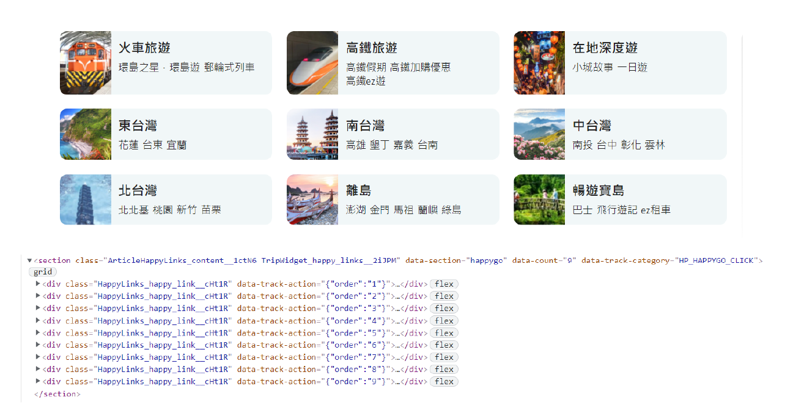
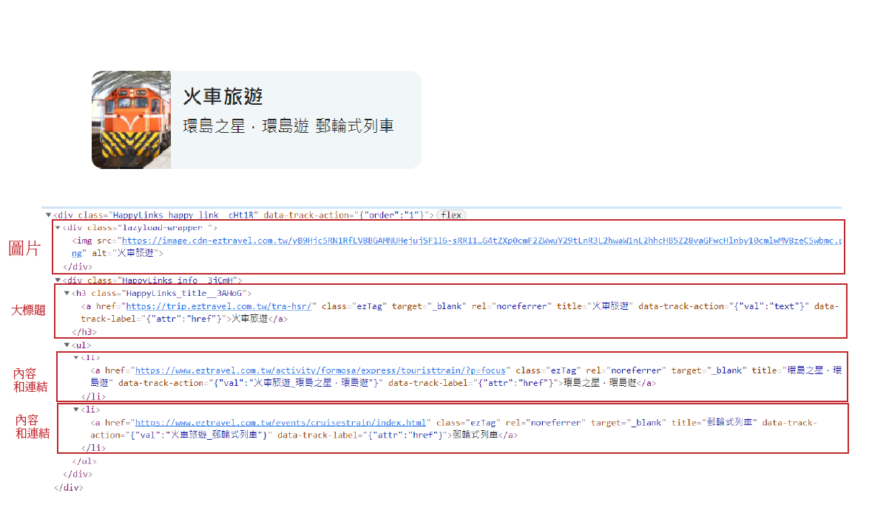
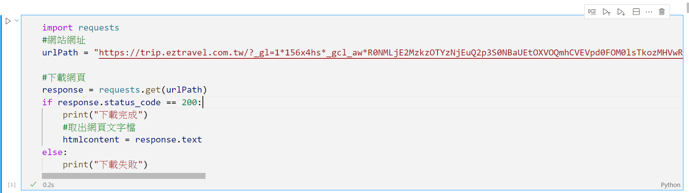
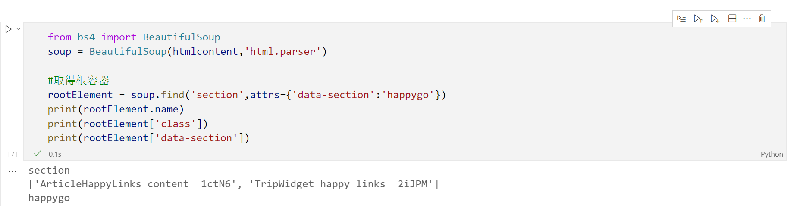
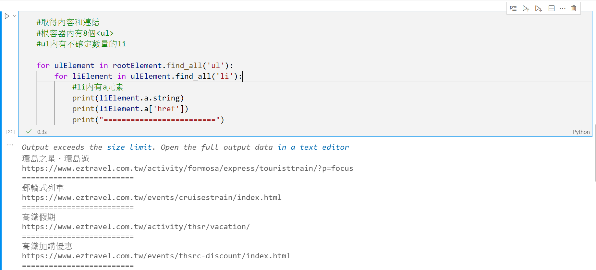

# 爬取靜態網頁資料

> 基礎的爬蟲技巧
> 本文的靜態網頁,所代表的是透過httpRequest所取得的html資料,而非事後由javascript動態所產生的資料

## 爬取網頁3個基本動作

#### 1. 分析網頁
#### 2. 下載網頁
#### 3. 解析網頁

## 爬取ezTravel網站的瘋台灣頁面


### 1. 分析網頁

#### 1_1. 取得網址(https://trip.eztravel.com.tw/?_gl=1*ws4hc9*_ga*MTMyODk1MTM3NC4xNjM5NDU0MDk3*_ga_XS4XWTQS4B*MTYzOTQ1NDA5Ny4xLjAuMTYzOTQ1NDA5Ny42MA..&_ga=2.226540765.1951541127.1639454097-1328951374.1639454097)

#### 1_2. 取得主架構資訊



```
元素:<section>
		class:"ArticleHappyLinks_content__1ctN6 TripWidget_happy_links__2iJPM" data-section="happygo"

		data-section:"happygo"

子元素:8個<div>
```


#### 1_3. 取得子架構資訊



```
圖片:<div class="lazyload-wrapper ">
	
</div>

大標題：<h3 class="HappyLinks_title__3AHoG">
	<a href="https://trip.eztravel.com.tw/tra-hsr/" class="ezTag" target="_blank" rel="noreferrer" title="火車旅遊" data-track-action="{&quot;val&quot;:&quot;text&quot;}" data-track-label="{&quot;attr&quot;:&quot;href&quot;}">火車旅遊</a>
</h3>

內容<ul>
	<li>
	<a href="https://www.eztravel.com.tw/activity/formosa/express/touristtrain/?p=focus" class="ezTag" rel="noreferrer" target="_blank" title="環島之星．環島遊" data-track-action="{&quot;val&quot;:&quot;火車旅遊_環島之星．環島遊&quot;}" data-track-label="{&quot;attr&quot;:&quot;href&quot;}">環島之星．環島遊</a>
	</li>
</ul>

連結：<ul>
	<li>
		<a href="https://www.eztravel.com.tw/events/cruisestrain/index.html" class="ezTag" rel="noreferrer" target="_blank" title="郵輪式列車" data-track-action="{&quot;val&quot;:&quot;火車旅遊_郵輪式列車&quot;}" data-track-label="{&quot;attr&quot;:&quot;href&quot;}">郵輪式列車</a>
	</li>
</ul>
```

### 2. 下載網頁

> 使用requests




```python
import requests
#網站網址
urlPath = "https://trip.eztravel.com.tw/?_gl=1*156x4hs*_gcl_aw*R0NMLjE2MzkzOTYzNjEuQ2p3S0NBaUEtOXVOQmhCVEVpd0FOM0lsTkozMHVwRU9rR2tvelo5QmdWNm9PMXZrcTQtVHJCYmpJLVlPdC1XN0lVTjR2WVdnWDFneGNCb0NXQlVRQXZEX0J3RQ..*_ga*MTg1NzA5NzUzMi4xNjM5Mzk1Mjgw*_ga_XS4XWTQS4B*MTYzOTQ1MjAyMS4zLjEuMTYzOTQ1MzQ3NS42MA..&_ga=2.42810533.1014596521.1639395280-1857097532.1639395280&_gac=1.87327338.1639396361.CjwKCAiA-9uNBhBTEiwAN3IlNJ30upEOkGkozZ9BgV6oO1vkq4-TrBbjI-YOt-W7IUN4vYWgX1gxcBoCWBUQAvD_BwE"


#下載網頁
response = requests.get(urlPath)
if response.status_code == 200:
    print("下載完成")
    #取出網頁文字檔
    htmlcontent = response.text
else:
    print("下載失敗")

```


- 網頁內容目前儲存於htmlcontent內

### 3. 解析網頁

#### 3_1 取得根容器



```python
from bs4 import BeautifulSoup
soup = BeautifulSoup(htmlcontent,'html.parser')


#取得根容器
rootElement = soup.find('section',attrs={'data-section':'happygo'})
print(rootElement.name)
print(rootElement['class'])
print(rootElement['data-section'])
```

- rootElement是根元素

#### 3_2 取得標題


```python
#取得標題內容
#根容器內有8個<h3>
#使用find_all('h3')


for h3Element in rootElement.find_all('h3'):
    #h3內有子元素a
    #子元素a有title屬性
    #有些h3沒有子元素,所以要用判斷式
    if h3Element.find('a'):
        print(h3Element.a['title'])
    else:
        print(h3Element.string)
```

#### 3_3 取得內容和連結



```python
#取得內容和連結
#根容器內有8個<ul>
#ul內有不確定數量的li


for ulElement in rootElement.find_all('ul'):
    for liElement in ulElement.find_all('li'):
        #li內有a元素
        print(liElement.a.string)
        print(liElement.a['href'])
        print("=========================")
```


